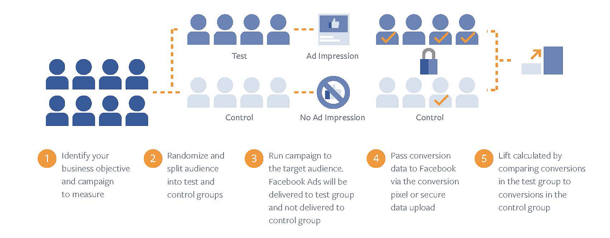
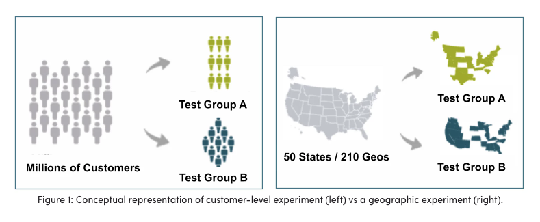
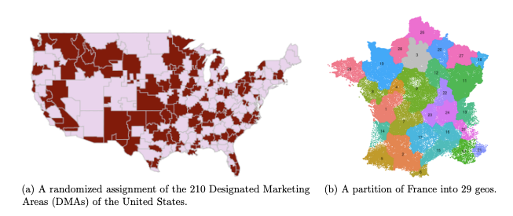
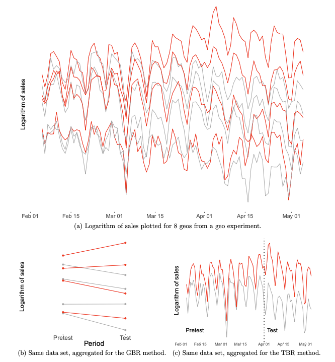
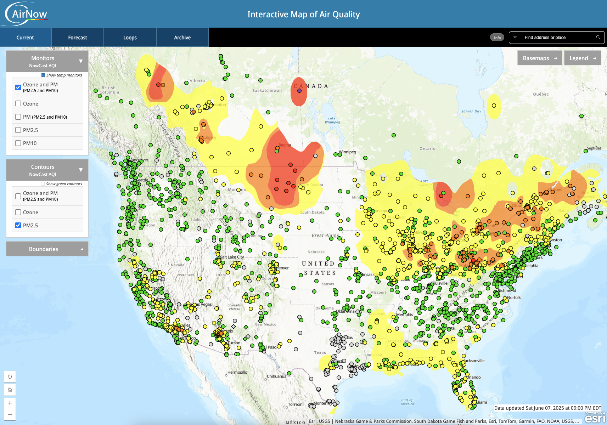
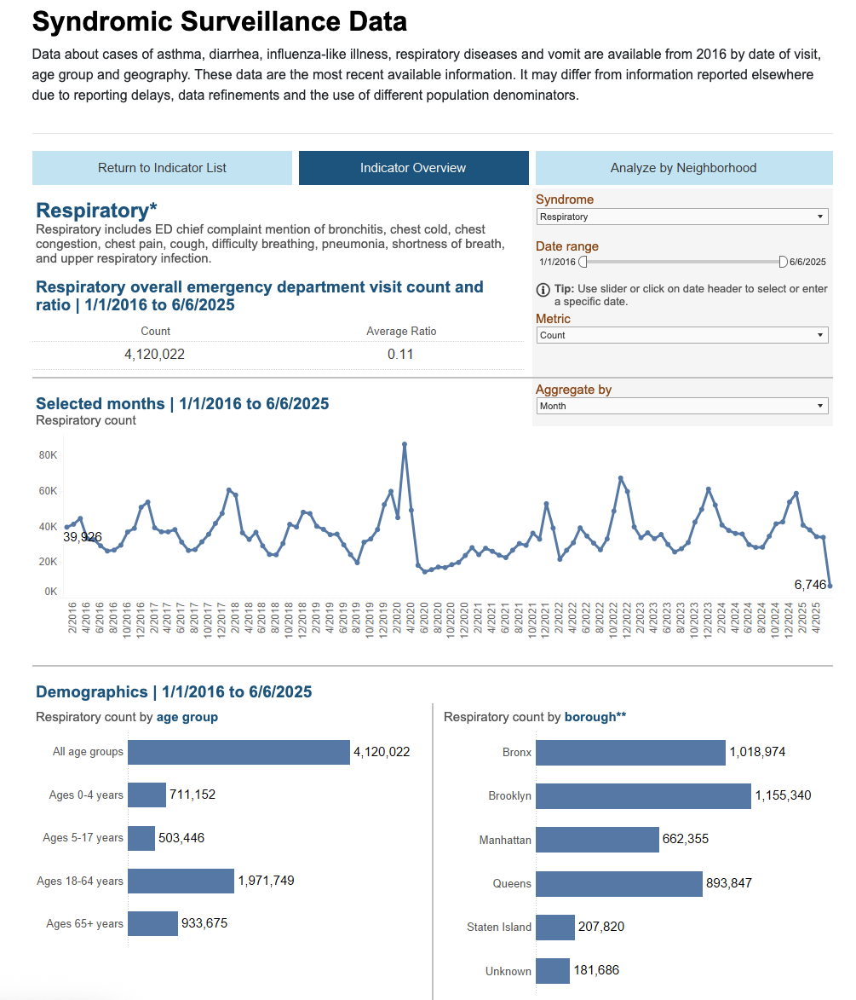
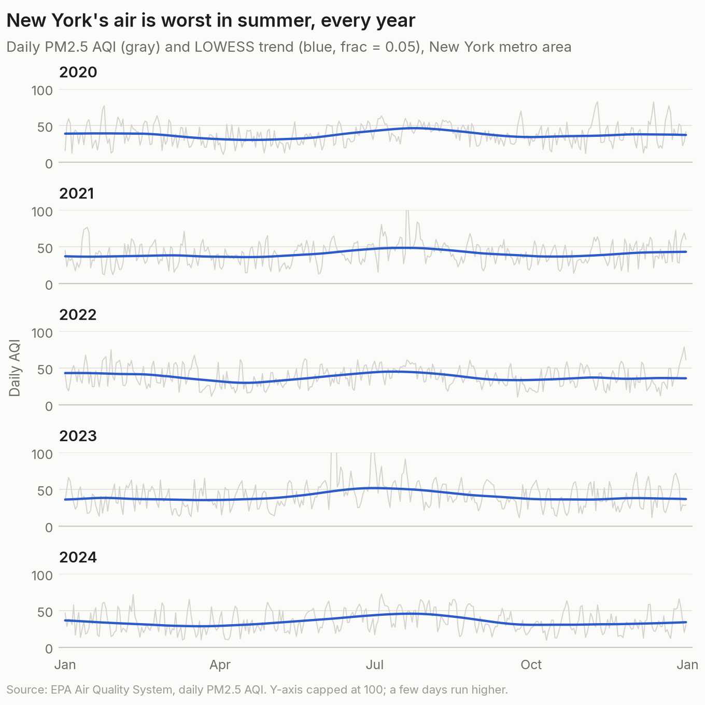
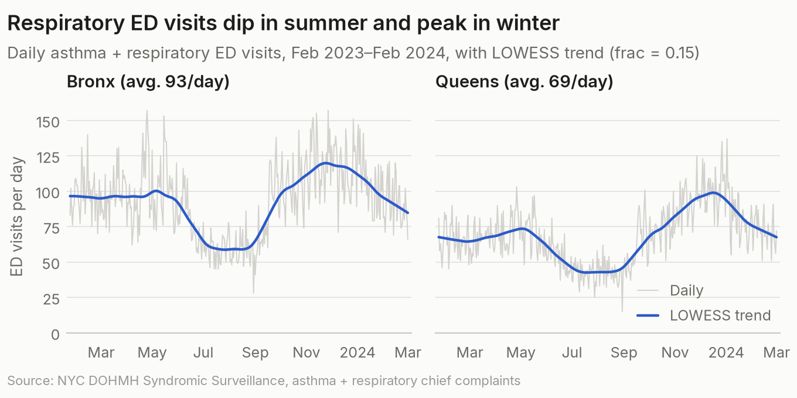
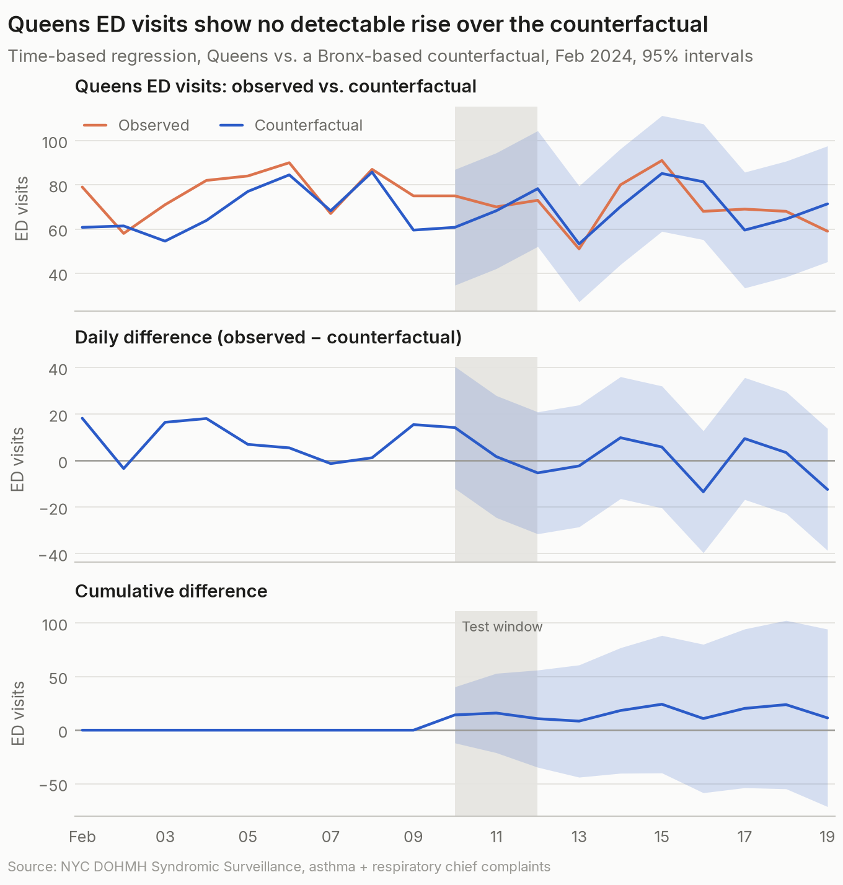
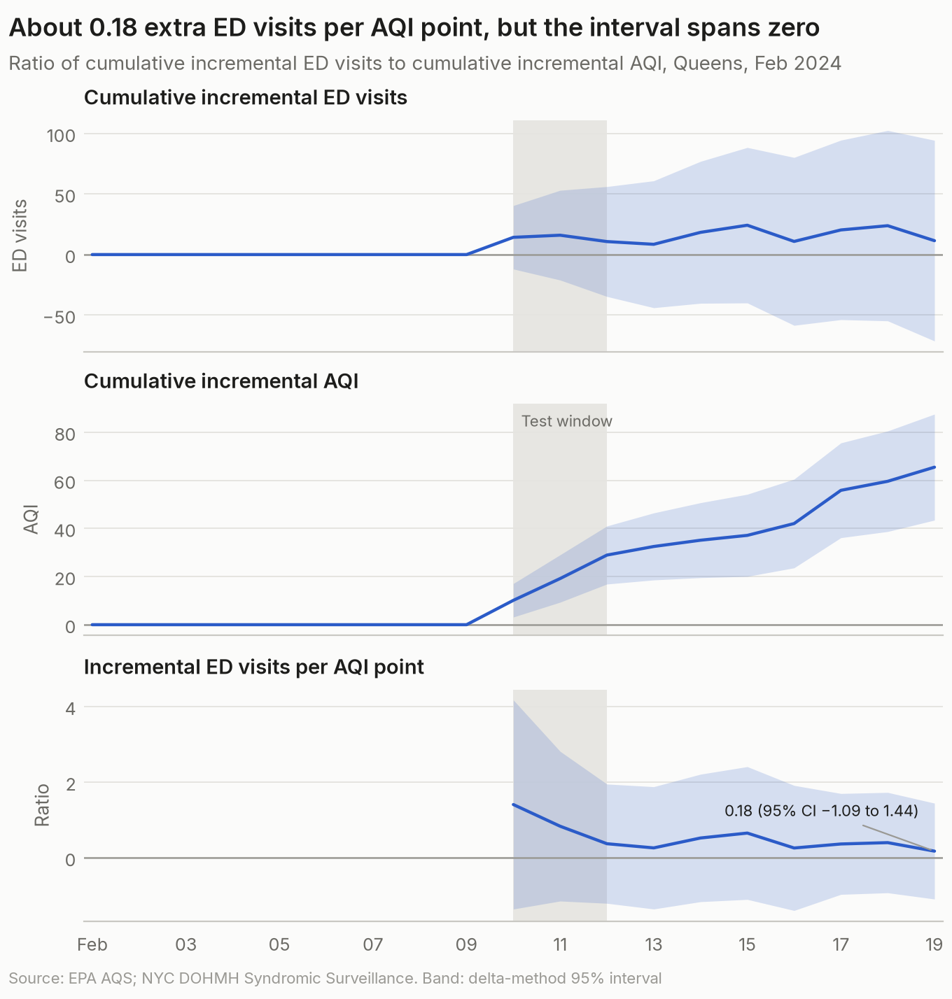

## TL;DR

This project explores whether worsening air quality causally increases emergency department visits for respiratory issues, using a geo experiment framework inspired by marketing attribution methods. By analyzing AQI and health data from the Bronx and Queens, and applying Google’s Time-Based Regression (TBR) methodology, I attempt to quantify the causal effect of AQI spikes on health outcomes. While the model shows a positive point estimate for additional ED visits per 1-point AQI increase, it is not statistically significant. Going forward, improvements to the model might be made by addressing limitations present in health outcome data.

## Background

As the climate crisis worsens, air quality is becoming an increasingly urgent concern worldwide. Rising temperatures, more frequent storms, and intensifying wildfires all contribute to deteriorating air conditions. It is well documented that declines in air quality impact both short- and long-term public health. In particular, elevated concentrations of PM2.5, fine particulate matter measuring 2.5 micrometers or less, are linked to a range of respiratory and cardiovascular problems. These microscopic particles can be inhaled deeply into the lungs, posing serious health risks.

On a personal note, poor air quality has directly affected my life. A “bad air day” in 2020 triggered a prolonged asthma flare-up, my first since childhood, which led to lingering respiratory issues. Since then, I’ve become more vigilant about tracking air quality, often using platforms like [PurpleAir](https://map.purpleair.com/) to avoid flare-ups and observe patterns that tend to coincide with declines in air quality.

While interactive maps offer accessible visualizations, I had never delved into the underlying data. This project began with a question: Can I causally link decreases in air quality to negative health outcomes? While this question has been addressed extensively by experts, I saw an opportunity to explore it through a creative statistical lens, especially since much of the publicly cited air quality data tends to be correlational. Here, I set out to perform a true causal impact analysis.

## Inspiration

While at Pinterest, my work in analytics focused primarily on marketing attribution, particularly incremental attribution, determining whether ads shown on the platform actually *caused* users to purchase a product. If users were going to purchase anyway, the ad had no incremental effect. However, showing with data that ads caused purchases is extremely powerful.

Typically, this kind of causal inference is achieved through large-scale randomized controlled trials (RCTs), in which one group sees ads (treatment) and another does not (control), and their subsequent behaviors are compared.

*Conversion lift experiment logic (source: Meta)*

In recent years, growing privacy constraints have limited access to user-level data, making traditional RCTs more difficult to conduct. This has led to greater interest in geo experiments, or matched market tests. Geo experiments measure causal impact by comparing outcomes across non-overlapping geographic regions that are matched based on similar pre-treatment characteristics. To isolate treatment effects, one region in each pair receives the treatment, while the other serves as a control. Notably, Google and Meta have each released open-source tools for this purpose, matched_markets and GeoLift, respectively.

*Geo experiment logic (source: Wayfair)*

In 2017, Google published *Estimating Ad Effectiveness using Geo Experiments in a Time-Based Regression Framework* [(Kerman et al., 2017)](#references), which outlines an approach using Time-Based Regression (TBR). This methodology models pre-treatment time series data to predict counterfactual outcomes, enabling estimation of cumulative treatment effects, even with as few as one test and one control region.

*Geo-Based Regression (GBR) and Time-Based Regression (TBR) (source: Google)*

## Approach

The TBR framework from Google seemed well-suited for estimating the causal impact of poor air quality on public health. Instead of ad spend as the treatment and sales revenue as the outcome, I substituted AQI as the treatment and emergency department (ED) visits for respiratory issues as the outcome. Since it’s not feasible (or ethical) to deliberately manipulate air quality, I sought out natural experiments, instances where AQI in one geographic area suddenly diverges from a nearby matched area, likely due to localized events such as wildfires or wind shifts.

This divergence point serves as the treatment “intervention.” Health outcome data from both areas can then be analyzed using TBR to estimate causal impact.

In marketing, a key outcome is incremental return on ad spend (iROAS): how much revenue is generated for each additional dollar spent. In this context, the analogous question is: *For every 1-point increase in AQI, how many additional ED visits occur that wouldn’t have happened otherwise?*

## Data

To perform this analysis, I needed two types of data. Ideally, both datasets should be at the daily-level to support time-series modeling.

### Air Quality Data

The EPA’s [Air Quality System (AQS)](https://aqs.epa.gov/aqsweb/documents/data_api.html) provides daily summary data on pollutants and meteorological conditions. I accessed this data via the AQS REST API.

*Interactive map of air quality data from EPA's Air Quality System (AQS) (source: EPA)*

### Health Outcome Data

I used the NYC Department of Health’s [Syndromic Surveillance Data (SSD)](https://a816-health.nyc.gov/hdi/epiquery/visualizations?PageType=ps&PopulationSource=Syndromic), which reports daily ED visits for asthma, respiratory disease, and other conditions. This dataset, covering all NYC ED visits from 2016 onward, can be filtered by zip code and age group. It’s important to note that this data reflects patient-reported symptoms rather than confirmed diagnoses.

*Syndromic Surveillance Data (SSD) Tableau dashboard (source: NYC Dept. of Health)*

### Notes on the Data

The AQS API was remarkably user-friendly and allowed bulk requests without apparent rate limits. Initially, I collected data at the Core Based Statistical Area (CBSA)-level, with the intention of assigning entire states/regions into treatment/control groups. However, I later pivoted to individual monitoring site-level data from NYC boroughs after encountering inconsistencies in national health outcome data. This allowed me to build a borough-level daily AQI dataset.

The SSD health data was more difficult to access. There was no API, and the Tableau dashboard required manually downloading small batches of data, one zip code at a time. Without a scraping solution, it was infeasible to collect years of daily data to match the AQI dataset.

## Exploratory Findings

Before modeling, I performed some EDA to validate assumptions and better understand patterns, many of which aligned with anecdotal observations from years of casually monitoring PurpleAir maps.

At the CBSA-level, I examined the 20 most populous US metro areas and grouped them by region (e.g. West, Northeast, etc.). The most extreme AQI days hit the West, Midwest, and Northeast, likely due to wildfires and extreme weather, while Southeast CBSAs had lower and more stable AQI levels.

*Within each regional subplot are multiple time series for each CBSA within that region*

Seasonally, AQI peaks in the summer months, with more extreme fluctuations. This is consistent with research showing that sunlight and heat accelerate the formation of ground-level ozone, while stagnant air traps pollutants. Wildfires also tend to peak in the summer.

In the New York region specifically, this AQI elevation during the summer months is fairly consistent year-over-year. To better visualize this in noisy data, I applied LOWESS smoothing.

At the borough-level, Brooklyn and Manhattan had substantial missing AQI data, so I focused on the Bronx and Queens. It’s important to note that a core part of the geo experiment framework is market-matching; identifying pairs of geographic units that align on one or more characteristics to ensure that the experiment groups are balanced. For marketing experiments, it’s completely realistic to assume that NY and LA might match based on purchase trends or user penetration statistics. But for this analysis, it makes more sense to compare areas that are geographically close to each other due to climate similarities. Thus, these two boroughs were selected as a result of their obvious proximity to one another and most importantly their data completeness.

The SSD health data was also noisy, although again I used LOWESS smoothing to visualize general trends over time. For geo experiments, the quality of causal estimates depends on how well the pre-treatment time series from control and treatment geographies align. Encouragingly, Bronx and Queens ED visit trends followed each other closely.

## Final Dataset

The final dataset consists of daily borough-level records, each with the AQI and total ED visits due to asthma or respiratory symptoms. The model inputs are really quite simple: 376 daily records from 2023-02-09 to 2024-02-19, each with AQI and total asthma + respiratory ED visits for both boroughs (`bronx_aqi`, `queens_aqi`, `bronx_ed`, `queens_ed`), with no missing values.

## Analysis

### Identify Natural Experiments

The key is to identify time periods when AQI in one borough (e.g., Queens) significantly diverges from the other (e.g., Bronx). These deviations serve as natural experiments.

I normalized AQI values using Z-scores and flagged days with a Z-score gap ≥ 0.5 as “divergent.” Only 16 such periods emerged, the longest being seven days starting on 2020-03-16, coinciding with the early COVID-19 outbreak, a major confounder.

A three-day period beginning on 2024-02-10 stood out as relatively clean.

**Geo experiment testing parameters:**

- Start date: February 10, 2024
- End date: February 12, 2024
- Pre-test window: 365 days
- Cooldown period: 7 days

We use a 365-day pre-test window to build robust counterfactual models for both air quality and health outcomes, ensuring a solid baseline for comparison. A 7-day cooldown period follows the test window to account for any delayed effects in the response variable, which is especially important in public health contexts where lagged outcomes are common.

### Model Pretest Relationship

I trained two linear regression models using pre-test data (Bronx as predictor, Queens as target) to forecast counterfactual values for AQI and ED visits in Queens.

Here are the results of the two models:

| Outcome   | Intercept | Bronx coefficient (SE) |    R² |   n |
| --------- | --------: | ---------------------: | ----: | --: |
| AQI       |     −0.31 |          1.043 (0.008) | 0.978 | 366 |
| ED visits |     10.15 |          0.625 (0.027) | 0.604 | 366 |

### Generate Counterfactual Predictions

Counterfactuals were generated across pre-test, test, and cooldown windows. Minimal difference during the pre-test period (i.e. centered around 0) validates model fit.

The AQI model had a very high R² of 0.98, indicating a robust counterfactual. The ED visit model had a more modest R² of 0.60, which, although statistically significant, suggests greater uncertainty and wider confidence intervals around causal estimates.

### Estimate Effects

Causal effects are summarized with three visuals:

- **Observed vs. counterfactual:** Plot the observed metric for Queens (our treatment unit) against its counterfactual prediction, including a 95% confidence interval. This visualization shows the difference between what actually happened and what would have occurred in the absence of the intervention.
- **Pointwise differences:** Calculate the daily difference between observed and counterfactual values, again with 95% confidence intervals. These reflect the estimated incremental effect for each individual day.
- **Cumulative effect over test + cooldown:** Aggregate the daily incremental effects over the test and cooldown periods to estimate the total impact of the intervention across the full analysis window.

*Counterfactual and incrementality results for AQI data*

*Counterfactual and incrementality results for ED visit data*

Once we’ve estimated cumulative effects for both AQI and ED visits, we calculate the pointwise unit ratio, essentially dividing the cumulative incremental ED visits by the cumulative increase in AQI. This is analogous to the iROAS metric in marketing, where the goal is to determine the return per unit of investment. In this context, it tells us: for every 1-point increase in AQI, how many additional ED visits occurred as a result?

The result: a ratio of 0.18 ED visits per AQI point, with a 95% CI of [-1.09, 1.44]. Though the point estimate is positive, the confidence interval includes zero, indicating no statistically significant effect.

## Takeaways

The primary limitation was the weaker-than-expected relationship between Bronx and Queens ED visits. This may stem from:

- A genuinely weaker correlation between the boroughs than hypothesized
- Incomplete or noisy data that masks the true relationship

While the adverse health impacts of PM2.5 are well-established, demonstrating this causal link at a borough-level scale using geo experiments is difficult. Data quality, availability, and geographic granularity present real challenges, ones that likely affect broader public health research as well.

## References

Jouni Kerman, Peng Wang, and Jon Vaver. [Estimating Ad Effectiveness Using Geo Experiments in a Time-Based Regression Framework](https://research.google/pubs/estimating-ad-effectiveness-using-geo-experiments-in-a-time-based-regression-framework/). *Google Research*, 2017.
