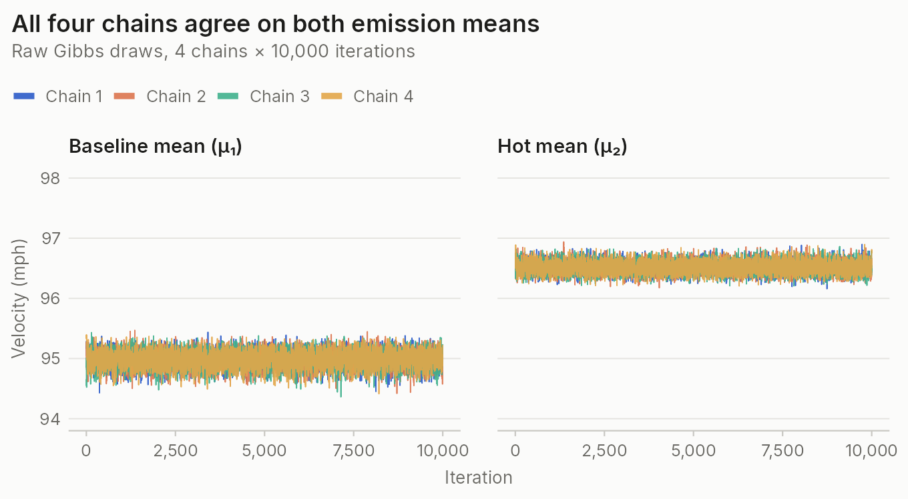

## TL;DR

A pitcher's "true condition" during a game is never directly observed; we only see noisy pitch-level measurements. In this project, we model Gerrit Cole's 2024 four-seam fastball velocity with a two-state Bayesian Hidden Markov Model (HMM), where each pitch is emitted from a latent *Baseline* or *Hot* performance regime. We place priors on the emission means, transition matrix, and initial state distribution, and fit the model with a Gibbs sampler that uses Forward-Filter Backward-Sample (FFBS) to draw the hidden state sequences. The model finds two clearly separated, highly persistent states (about 95.0 vs. 96.5 mph) and a clean warm-up pattern within each start, but posterior predictive checks show it misses the spread and pitch-to-pitch persistence of real velocities. A revised model with state-specific variances and a within-game trend fixes the spread, though some temporal dependence remains unexplained. This was a group project for STAT 5440 at Penn in Spring 2026, delivered as a mini-lecture and reproducible tutorial.

## Motivation

Think about the last time you tried to figure out if a friend was in a bad mood. You couldn't see inside their head, but you could observe their behavior. That intuition, inferring something hidden from things you *can* observe, is exactly what a Hidden Markov Model does, just in a much more mathematical way.

A Markov model describes a sequence of discrete states where the probability of moving to the next state depends only on the current state. A Hidden Markov Model extends this by introducing an underlying state that drives the observations but is never directly observed. Every HMM has three components:

1. **Hidden states**: a discrete set of underlying conditions that evolve over time according to a Markov process.
2. **Transition matrix**: the probabilities of moving from one hidden state to another.
3. **Emission probabilities**: given the current hidden state, the probability of each observable outcome.

The goal of the HMM is to work backwards: given the sequence of observations, what can we infer about the hidden states that generated them? To make an HMM Bayesian, we place priors on the transition and emission parameters, which lets us incorporate domain knowledge and gives us full posterior distributions over both the parameters and the hidden state sequences, rather than just point estimates.

Standard regression can't handle this problem for three reasons. First, the cause is invisible: the driver of the outcome is the hidden state, so there is no covariate to include. Second, the independence assumption is violated: each observation depends on the hidden state, and each hidden state depends on the previous one, which encodes severe autocorrelation into the data. Third, the data-generating process itself changes with the hidden state, and we can't fit a separate regression per state because we don't know which observations belong to which state. HMMs solve this by estimating the hidden states and the model parameters simultaneously.

HMMs were the backbone of speech recognition for decades, and have been used in genomics, to identify market regimes in finance, and in sports analytics to model whether a player is "hot" or "cold." This last application is what we explore here.

## Data

We apply the model to pitch-level data for **Gerrit Cole**, a right-handed starting pitcher for the New York Yankees, selected for his high four-seam fastball usage and consistent full seasons of starts. Pitch-level data come from MLB Statcast via the `baseballr` package, covering the 2019–2024 seasons and retrieved in weekly chunks from Baseball Savant.

We model a single observable, `release_speed`, for four-seam fastballs only. Restricting to one pitch type is essential, since mixing pitch types would cause the HMM to discover pitch type as the hidden state rather than performance condition. Velocity is the most straightforward and interpretable signal of a pitcher's condition: elevated velocity indicates peak effort, while declining velocity often signals fatigue.

We fit the model to the 2024 season (17 starts, 697 four-seam fastballs). Within each game, pitches are sorted by inning, at-bat, and position within the at-bat to recover true chronological order. Each game is treated as an **independent sequence**: the hidden state resets at the beginning of each game, reflecting the 4–5 days of rest between starts. Seasons before 2024 are used only to set priors.

## Model Specification

### Likelihood

Let $y_{g,t}$ denote the observed four-seam fastball velocity for pitch $t$ in game $g$, and let $z_{g,t} \in \{1,2\}$ denote the corresponding latent state, representing *Baseline* and *Hot* performance regimes. Conditional on the latent state,

$$
y_{g,t} \mid z_{g,t} = k \sim \mathcal{N}(\mu_k, \sigma^2),
$$

where $\mu_k$ is the state-specific mean velocity and $\sigma^2$ is a shared variance, fixed to the empirical variance of the 2024 velocities. The latent state evolves according to a first-order Markov process,

$$
P(z_{g,t} = k \mid z_{g,t-1} = j) = \nu_{j,k},
$$

where $\nu$ is a $2 \times 2$ transition matrix, and at the beginning of each game the state is drawn from an initial distribution, $z_{g,1} \sim \text{Categorical}(\pi)$.

This defines the generative hierarchy $(\mu, \nu, \pi) \rightarrow z_{g,t} \rightarrow y_{g,t}$. It is important to emphasize that this is a **latent variable hierarchy**, not a multilevel random effects model: there are no group-specific parameters, and therefore no partial pooling across games or players.

### Priors

**Emission means.** $\mu_k \sim \mathcal{N}(m_k, s^2)$ with $s = 2$ mph. To center the priors, we split Cole's pre-2024 fastball velocities at the 75th percentile: the lower 75% approximate the Baseline state and the upper 25% the Hot state, yielding prior centers of $m_1 = 96$ and $m_2 = 99$ mph. This is a rough heuristic; a 75/25 split doesn't correspond to any structural assumption about how often Cole is in each state. With hundreds of 2024 pitches available, the likelihood dominates.

**Transition probabilities.** Each row of the transition matrix gets a Dirichlet prior, $\nu_j \sim \text{Dirichlet}(\alpha_{j1}, \alpha_{j2})$, with $\alpha_{jj} = 8$ and $\alpha_{jk} = 1$ for $j \neq k$ (a prior probability of staying of about 89%). This reflects the belief that a pitcher's state tends to persist from one pitch to the next: states are sticky, not erratic.

**Initial state distribution.** $\pi \sim \text{Dirichlet}(6, 2)$, putting about 75% of the prior weight on starting a game in the Baseline state.

The Dirichlet's conjugacy with multinomial counts is what makes this model convenient: once latent states are sampled, posterior updates reduce to adding observed transition counts to the prior parameters.

### Key Assumptions

The model assumes exactly two latent states, time-homogeneous transitions, and Normal emissions with a single shared variance and a single observable. If the true process exhibits more nuanced variation, the model will compress it into two regimes; transition dynamics may in practice depend on pitch count, fatigue, or inning; and real velocity data may exhibit skewness, heavy tails, or within-game trends that this specification cannot capture. Because HMM states are label-invariant under the likelihood, we also impose the ordering constraint $\mu_1 < \mu_2$, so that state 1 is always *Baseline* and state 2 is always *Hot*.

## Gibbs Sampler

Because the full joint posterior is intractable, we use a **Gibbs sampler** that cycles through each block of unknowns, drawing from its conditional distribution given the current values of everything else. The hidden state sequences are not parameters in the usual sense, but conditioning on them makes the parameter updates simple conjugate draws, so we include them in the sampler. Each iteration performs four steps:

1. **Sample hidden states (FFBS).** For each game independently, the forward pass computes $\alpha_{t,k}$, the joint probability of the observed velocities up through pitch $t$ and being in state $k$ at pitch $t$. The backward pass draws the last pitch's state from the normalized final forward probabilities, then samples each earlier state conditional on the state drawn immediately after it. This produces an exact draw from $p(\mathbf{z} \mid \mathbf{y}, \mu, \nu, \pi)$.
2. **Sample transition probabilities ($\nu$).** Count each state-to-state transition across all games, add the counts to the Dirichlet prior, and draw each row from its Dirichlet full conditional.
3. **Sample the initial distribution ($\pi$).** Count how many games begin in each state and draw $\pi$ from the updated Dirichlet.
4. **Sample emission means ($\mu_k$).** Pool all pitches assigned to state $k$ and draw $\mu_k$ from its conjugate Normal full conditional.

We also apply a **label-switching correction**: because the states are exchangeable under the likelihood, the sampler can freely permute their labels between iterations. After each draw, we sort the states so that $\mu_1 < \mu_2$, relabeling the state assignments, both rows and columns of $\nu$, and $\pi$ accordingly. We run **four independent chains** of 10,000 iterations from dispersed starting values.

## MCMC Diagnostics

Four well-mixed chains that overlap and wander around the same region, rather than drifting apart or getting stuck, are the primary visual signal that the sampler has converged. The trace plots for every parameter look like the one below.

*Raw Gibbs draws for the emission means, 4 chains × 10,000 iterations*

Autocorrelation functions show that autocorrelation across all parameters decays fully by roughly lag 8–10. We discard the first 1,000 iterations as burn-in and thin by keeping every 10th sample, leaving 900 draws per chain (3,600 combined). On the full unthinned chains, every $\hat{R}$ is 1.000–1.001 and bulk effective sample sizes range from about 6,800 to 17,500.

## Posterior Results

| Parameter | Mean | SD | 10% | 90% |
| --- | --: | --: | --: | --: |
| $\mu_1$ (Baseline mean, mph) | 94.984 | 0.126 | 94.821 | 95.139 |
| $\mu_2$ (Hot mean, mph) | 96.517 | 0.092 | 96.401 | 96.638 |
| $\nu_{11}$ (Baseline → Baseline) | 0.905 | 0.027 | 0.870 | 0.937 |
| $\nu_{12}$ (Baseline → Hot) | 0.095 | 0.027 | 0.063 | 0.130 |
| $\nu_{21}$ (Hot → Baseline) | 0.038 | 0.014 | 0.022 | 0.056 |
| $\nu_{22}$ (Hot → Hot) | 0.962 | 0.014 | 0.944 | 0.978 |
| $\pi_1$ (start in Baseline) | 0.860 | 0.082 | 0.744 | 0.956 |
| $\pi_2$ (start in Hot) | 0.140 | 0.082 | 0.044 | 0.256 |

*Posterior summaries from 3,600 thinned draws (4 chains × 900 samples)*

The two states are clearly separated and both are highly persistent; the Hot state is especially sticky, with a 96% chance of staying from one pitch to the next.

The plot below pairs observed fastball velocity (top row) with the posterior $P(\text{Hot})$ for each pitch (bottom row), one column per game. The three games are chosen to span the within-game $\text{sd}(P(\text{Hot}))$ distribution, from starts where the model is entirely confident to starts where it is actively switching states. Reading each column vertically is the central diagnostic: a pitch near $\hat\mu_{\text{Hot}}$ should line up with a point near 1 directly below it, and a pitch near $\hat\mu_{\text{Baseline}}$ with a point near 0.

*Velocity and posterior P(Hot) for three 2024 starts*

**How this lines up with reality:** Cole's 2024 was cut in half by an elbow injury that sidelined him through mid-June, which is why "game 2" in this plot is already June 25 and "game 9" lands on August 10. Game 2 was his second outing back, a Subway Series loss in which he struggled and next-day coverage ran with headlines like *"Gerrit Cole's Subway Series clobbering comes with stark velocity concerns"* (Joyce, *NY Post*, 2024-06-25). Game 9 was the opposite: six scoreless innings and a season-high ten strikeouts against Texas, widely reported as a return to ace form. The HMM never saw a box score or a headline, it only saw release speeds, but the pitch-level posterior on these two starts already encodes what the writers were saying at the time, which is a useful sanity check that the latent "Hot" state is picking up something real.

We can also ask: *on average, how hot is Cole as a function of pitch index within a start?* For each pitch position $t$, and separately in every Gibbs draw, we compute the fraction of games (among those that reached pitch $t$) that were in the Hot state at that pitch.

*Share of starts in the Hot state by pitch number, posterior mean with 95% credible interval*

The curve tells a clean warm-up story. The first few pitches sit deep in the Baseline state, the estimate climbs monotonically and crosses 0.5 early in the outing, and from there it plateaus above 0.5 for the rest of the game. This is the familiar pattern of a pitcher getting loose in the first inning, now showing up in the pitch-level posterior.

## Posterior Predictive Checks

To assess model fit, we take a posterior draw of $(\mu, \nu, \pi)$, simulate a full replicated "season" of velocities that preserves the observed game lengths, compute summary statistics, and repeat 500 times. The statistics are overall mean velocity, overall standard deviation, mean within-game range, and mean lag-1 autocorrelation. Lag-1 autocorrelation is important because it captures pitch-to-pitch persistence within games, which is a defining feature of the HMM's Markov structure.

| Statistic | Observed | Replicated mean | 95% interval |
| --- | --: | --: | --: |
| Overall mean velocity (mph) | 95.918 | 95.904 | [95.641, 96.168] |
| Overall velocity SD (mph) | 1.284 | 1.482 | [1.386, 1.579] |
| Mean within-game range (mph) | 4.982 | 6.184 | [5.742, 6.694] |
| Mean within-game lag-1 autocorrelation | 0.431 | 0.129 | [0.040, 0.221] |

*Posterior predictive check, original model*

The results indicate inadequate model performance. The overall mean velocity is well captured, but the model performs poorly on higher-order structure. The observed lag-1 autocorrelation lies far outside the replicated range, indicating that the model substantially underestimates temporal persistence, and the observed within-game range and overall standard deviation fall outside their replicated distributions. A density overlay tells the same story: the observed velocity distribution is sharper and more asymmetric than the smoother, more diffuse replicated densities. While the model captures the central tendency of the data, it fails to reproduce key features of variability and temporal dependence, indicating a misspecification in the underlying data-generating assumptions.

## Revised Model

To address the lack of fit, we extend the emission distribution in two ways. First, we allow **state-specific variances**, so that variability may differ between the Baseline and Hot regimes. Second, we add a **linear within-game pitch-number trend** using a centered covariate $x_{g,t} = t - \bar t_g$. The observation model becomes

$$
y_{g,t} \mid z_{g,t}=k \sim \mathcal{N}(\mu_k + \beta x_{g,t}, \sigma_k^2),
$$

where $\beta$ is a linear pitch-number effect shared across states. The latent Markov structure is unchanged. We keep the same priors on $\mu$, $\nu$, and $\pi$ and add $\beta \sim \mathcal{N}(0, 1)$ and $\sigma_k^2 \sim \text{IG}(2, 1)$. The Gibbs sampler gains two conjugate blocks, a Normal full conditional for $\beta$ and inverse-gamma full conditionals for $\sigma_1^2, \sigma_2^2$, and FFBS now uses the trend-adjusted state means and state-specific standard deviations. This model is designed to separate three distinct sources of structure: **state differences in mean velocity**, **within-state variability**, and **systematic within-game change**, rather than forcing all of it into state switching.

With the same burn-in, thinning, and four chains, all $\hat{R}$ values are 1.000–1.001 and bulk ESS ranges from about 2,400 to 21,000.

| Parameter | Mean | SD | 10% | 90% |
| --- | --: | --: | --: | --: |
| $\mu_1$ (Baseline mean, mph) | 95.014 | 0.117 | 94.859 | 95.161 |
| $\mu_2$ (Hot mean, mph) | 96.759 | 0.091 | 96.641 | 96.873 |
| $\beta$ (pitch-number trend) | 0.005 | 0.006 | −0.004 | 0.013 |
| $\sigma_1^2$ (Baseline variance) | 1.077 | 0.102 | 0.947 | 1.207 |
| $\sigma_2^2$ (Hot variance) | 0.710 | 0.078 | 0.610 | 0.813 |
| $\nu_{11}$ (Baseline → Baseline) | 0.877 | 0.029 | 0.839 | 0.912 |
| $\nu_{22}$ (Hot → Hot) | 0.909 | 0.022 | 0.879 | 0.937 |
| $\pi_1$ (start in Baseline) | 0.884 | 0.072 | 0.786 | 0.966 |

*Posterior summaries for the revised model (3,600 thinned draws)*

The Baseline and Hot states remain clearly separated (about 95.0 vs. 96.8 mph), and both remain highly persistent. The trend $\beta$ is small, with uncertainty spanning zero, suggesting only weak evidence of a systematic within-game velocity trend after accounting for state switching. The Baseline state has higher variability than the Hot state, indicating that elevated performance is more consistent, while baseline pitching is noisier.

| Statistic | Observed | Replicated mean | 95% interval |
| --- | --: | --: | --: |
| Overall mean velocity (mph) | 95.918 | 95.920 | [95.629, 96.176] |
| Overall velocity SD (mph) | 1.284 | 1.284 | [1.185, 1.372] |
| Mean within-game range (mph) | 4.982 | 5.175 | [4.769, 5.628] |
| Mean within-game lag-1 autocorrelation | 0.431 | 0.279 | [0.187, 0.374] |

*Posterior predictive check, revised model*

The revised model shows substantial improvement in overall fit. The observed mean and standard deviation now lie near the center of the replicated distributions, and the within-game range is reasonably captured. However, the model still underestimates temporal dependence: the observed lag-1 autocorrelation lies above the replicated interval, indicating that real pitch velocities are more persistent than the model can reproduce.

It is important to note that under the revised model, latent states are no longer interpreted as raw "Baseline" and "Hot" regimes alone. Instead, they represent performance regimes *after accounting for* a linear within-game trend and state-specific variability. This improves fit, but it also makes interpretation less direct.

## Conclusion

The HMM identifies meaningful latent performance regimes using only velocity, with clear separation between Baseline and Hot states and strong persistence across pitches. This supports the idea that pitcher condition evolves gradually rather than randomly. The original model, however, attributes too much structure to state switching, producing unrealistic dynamics. The revised model improves this by separating differences in mean velocity, variability within states, and systematic changes over a game, which results in a substantially better fit.

The original model is suitable when a simple, interpretable framework is sufficient and the goal is to detect coarse regime changes. The revised model is preferred when within-sequence trends or differences in variability are present, and when improved fit and realism are more important than simplicity.

## Limitations

Despite improvements, the model remains a rough oversimplification. It relies on a single observable (velocity), ignoring other relevant signals such as spin rate, release position, or pitch movement. It is also only used to examine one pitcher; a hierarchical structure with partial pooling would be needed to apply it to multiple players. The model ignores external context such as inning, opponent, or game conditions, and Gibbs sampling over latent states is computationally intensive.

Inference also depends on key modeling choices: the number of latent states, the priors, and the form of the emission distribution. Two states may compress more complex behavior, the Normal emissions may miss skewness or heavy tails, and in the revised model the trend, variance, and state-switching components can compete to explain the same structure. Finally, even the revised model underestimates temporal dependence, indicating that some dynamic structure remains unexplained.
